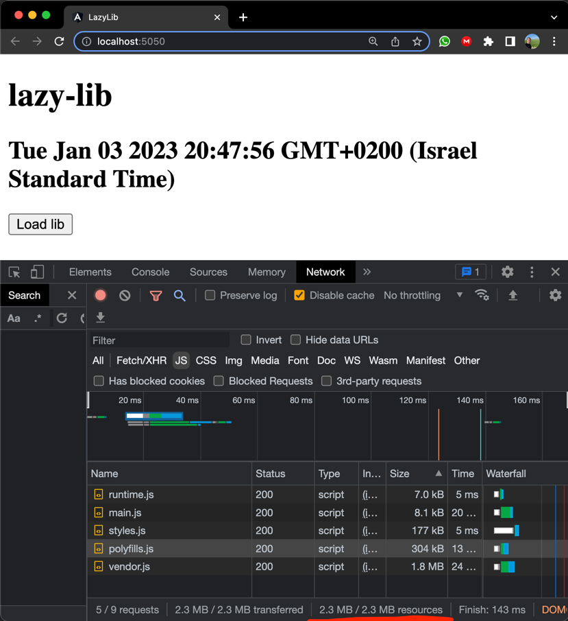

# LazyLib

This project was generated with [Angular CLI](https://github.com/angular/angular-cli) version 13.3.5.

## Guid
https://www.digitalocean.com/community/tutorials/angular-angular-webpack-bundle-analyzer

## Steps:
1) run `npm install`.
2) run `npm run build:stats` to create the production bundle. 
3) run `npm run analyze` to see the **webpack-bundle-analyzer** 
4) run `npm start` and open the network tab to see the javascript files total size.
as you can see:

5) run npm install pptxgenjs@^3.11.0 --save 
6) uncommitted the function load: `AppComponent.load`
7) open network and see that the js files does not load before you click load

[//]: # ()
[//]: # ("jspdf": "^2.5.1",)

[//]: # ("pptxgenjs": "^3.11.0",)
