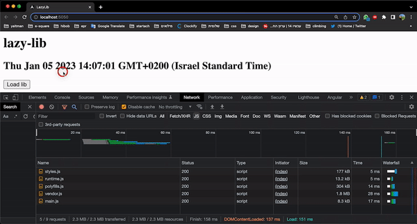

# LazyLib

This project was generated with [Angular CLI](https://github.com/angular/angular-cli) version 13.3.5.

## Steps the poc:
1) Run `npm install`.
2) Run `npm run build:stats` to create the production bundle. 
3) Run `npm run analyze` to see the **webpack-bundle-analyzer** 
4) Run `npm start` and open the network tab to see the javascript files total size.
as you can see:

5) Run `npm install pptxgenjs@^3.11.0 --save`.
6) Run `npm start` and see that the resources are still 2.3MB.
7) Uncommitted the function load: `AppComponent.load`
8) Open network and see that the js files does not load before you click load
9) Only after click load the resourses are 2.9MB
   

## Guid
https://www.digitalocean.com/community/tutorials/angular-angular-webpack-bundle-analyzer
